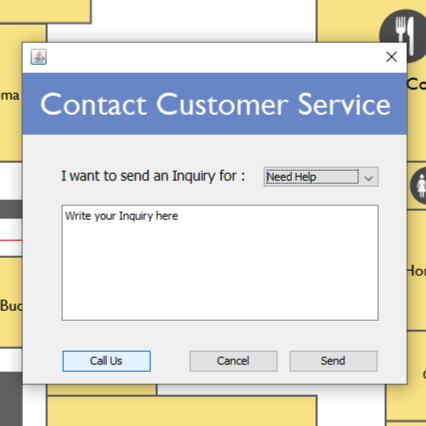

# Smart Mall Map Application

**Desktop Application Demo Project using Java Language**

> This is an application for a Smart System of a Mall map that helps mall visitors to navigate to different facilities and vendors in the mall through some useful functionalities that enhances mall visitors experience other than printed manual mall maps

## Requirements Engineering ✨

#### Functional Requirements
- A visitor can search for facility inside the mall map.
- A visitor shall be able to get direction to a the chosen facility
- A visitor shall be able to view info about a certain facility that they chose.
- A visitor can call customer service to get support or to report a problem.
- Admin should be able to view, add, and manage facilities on system map.
- Facility actor should be able to view, add, and manage his/her facility information.
- Advertiser can post the advertisement on the map and the admin should confirm it.

#### Non Functional Requirements
- **Robustness:** System should be recovering after one minute.
- **Reliability:** System should not go down more than 2 times in every 3 months.
- **Speed:** System should give direction to visitor under 2 seconds.
- **Explicitly:** The icons and fonts in the mall map should be big and clear for normal person

## Software Design 📐
#### Use Case Diagram
<!--  -->

#### Class Diagram

## Built With ⚡️
- Java Language,
- Java Swing GUI,
- OOP Concepts,
- Derby Database,
- NetBeans IDE,
- Draw.io

## Project Preview 👀
#### Main Screen
<!--  -->

#### View Direction
<!--  -->

Customer Service Menu | Facility Details Menu
:---------:|:-------------------------:
 | 

## Authors

👤 **Yousef Hussien**

- Github: [@yousefhussien727](https://github.com/yousefhussien727)
- Linkedin: [/in/yousefhussien](https://www.linkedin.com/in/yousefhussien/)

## Show your support ❤
Give a ⭐️ if you like this project!

## License 📝
This project is [MIT](./LICENSE.txt) licensed.
